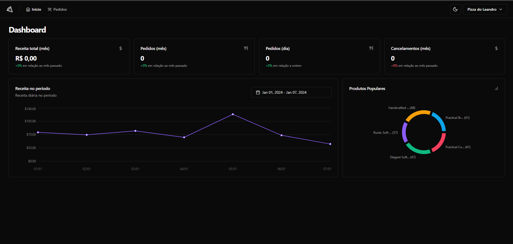
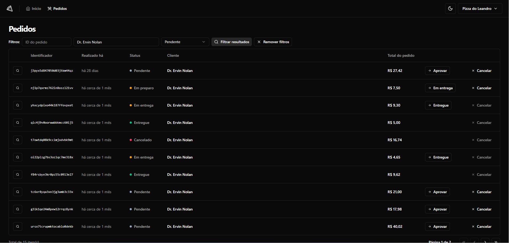

# Pizza Shop - Dashboard for business management 🍕

<br>

<p align="center">
  <a href="#-about-the-project">About the project</a> •
  <a href="#-technologies">Technologies</a> •
  <a href="#-features">Features</a> •
<a href="#-getting-started">Getting started</a> •
<a href="#-license">License</a>

</p>

<p align="center">
 
 
  


</p>

## 👩‍💻 About the project

This system acts as a control panel for restaurant owners who integrate their establishments with delivery apps such as iFood/Uber Eats. In this dashboard, you can monitor various essential metrics for the business, such as monthly sales, daily sales, among others. In addition, it offers the possibility of detailed monitoring of each order, displaying information such as the items sold, allowing the status of the order to be changed, as well as the option to cancel, providing greater control and efficiency in the management of the establishment.

This project applies the concepts of communication with APIs via HTTP requests and end-to-end tests (MSW, PlayWright) and unit tests (Vitest, testing-library-react, HappyDOM).

**Note:** To use the application, run both the server and the web app. Install the API by following the steps in this repository: [Pizza Shop API](https://github.com/leandrorodrigues00/pizzashop-api).

## 🚀 Technologies

- React
- React Router DOM
- Tailwind
- shadcn/ui
- React Query
- Radix
- MSW (Mock Service Worker )
- PlayWright
- Vitest
- Testing-library-react

## Features

- Establishment registration;
- Establishment login (magic link);
- Customer registration;
- Creation of new orders;
- Menu management;
- Reviews management;
- Orders management;
- Establishment profile management;
- Metrics for dashboard;
  - Chart of orders in the last 15 days;
  - Chart of values in the last 15 days;
  - Average ratings (monthly/overall);
  - Average orders per day (monthly/overall);

## 💻 Getting started

### Requirements

- [Pizza Shop API](https://github.com/leandrorodrigues00/pizzashop-api). (Click on the link if you don't already have the API set up and running.)
- [Node.js](https://nodejs.org/en/)
- [Yarn](https://classic.yarnpkg.com/) or [NPM](https://www.npmjs.com/) _(examples are with NPM)_

**Clone the project and access the folder**

```bash
$ git clone https://github.com/leandrorodrigues00/pizza-shop && cd pizza-shop

```

**Follow the steps below**

```bash
# Install the dependencies
$ npm i

# Make a copy of '.env.example' to '.env'
# and set with YOUR environment variables.
$ cp .env.example .env

# Start the app
$ npm run dev
```

## 📝 License

This project is licensed under the MIT License - see the [LICENSE](LICENSE) file for details.

---

<p align="center">
  Made with 💜&nbsp; by  Leandro Rodrigues
</p>
